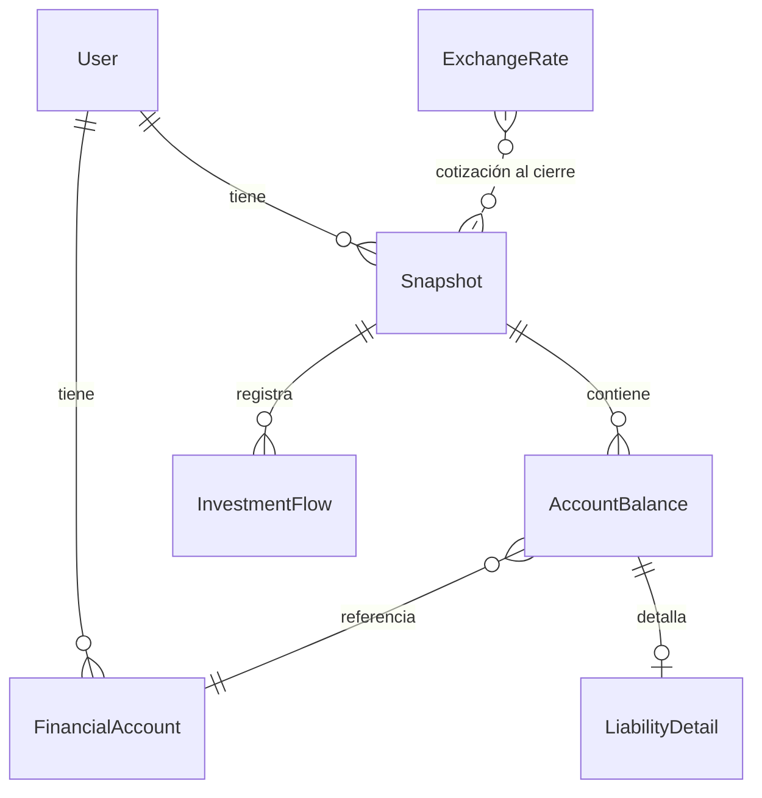
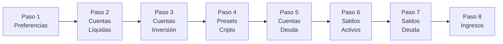
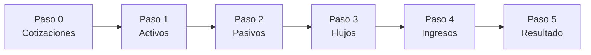
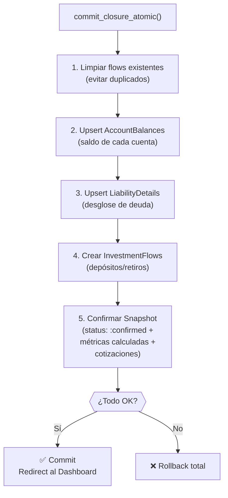
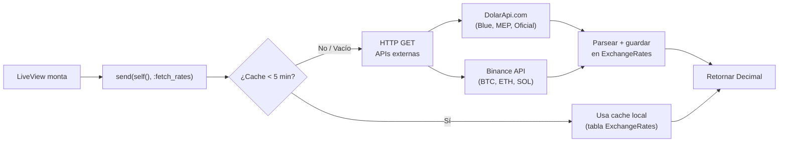
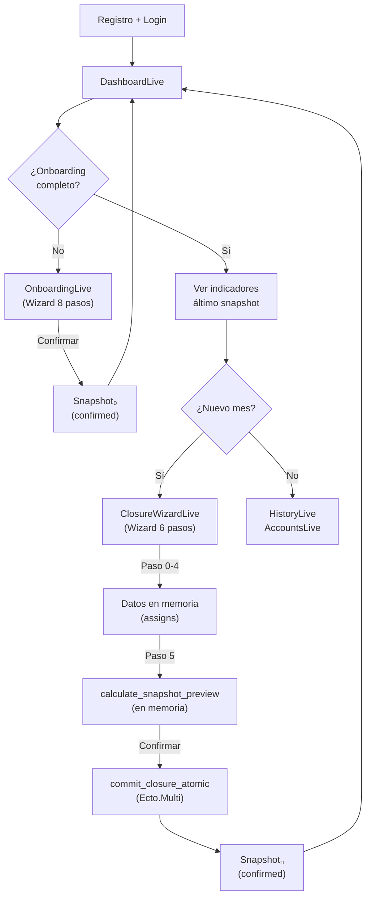

# PerFi Delta — Resumen de Procesos y Flujo de Datos

## 1. Visión General

PerFi Delta calcula el enriquecimiento real del usuario mes a mes mediante **diferencia patrimonial**, en lugar de rastrear gastos individuales. El flujo de datos sigue un circuito cíclico:

```
Registro → Onboarding (Snapshot₀) → [Cierre Mensual (Snapshotₙ) → Dashboard/Historial] ↻
```

> [!NOTE]
> Toda la aritmética monetaria usa `Decimal` (nunca `Float`). La moneda base en la DB es **USD**; los valores en ARS se convierten al momento de guardar usando la cotización vigente.

---

## 2. Modelo de Datos (Entidades y Relaciones)



| Entidad              | Propósito                                                                 |
|----------------------|---------------------------------------------------------------------------|
| **User**             | Autenticación (`phx.gen.auth`). Campos: email, password, `onboarding_step`. |
| **FinancialAccount** | Dónde está el dinero o la deuda. Tipos: `liquid`, `investment`, `liability`. Monedas: ARS, USD, BTC, ETH, SOL, USDT. |
| **Snapshot**         | Foto mensual inmutable. Unique constraint `(user_id, month, year)`. Estados: `draft` → `confirmed`. |
| **AccountBalance**   | Saldo de cada cuenta en un snapshot. Guarda el valor nominal y el equivalente en USD. Para liabilities, el `amount_usd` es negativo. |
| **LiabilityDetail**  | Relación 1:1 con `AccountBalance`. Separa `current_period_balance` (vence este mes) de `future_installments_balance` (cuotas futuras). `total_debt` se calcula automáticamente. |
| **InvestmentFlow**   | Inyecciones/retiros de capital en inversiones. Dirección: `deposit` o `withdrawal`. Necesario para aislar el rendimiento real. |
| **ExchangeRate**     | Cache local de cotizaciones. Pares: `USD_ARS`, `BTC_USD`, etc. TTL de 5 min. |

---

## 3. Flujo de Datos Paso a Paso

### 3.1. Registro y Autenticación

```
Usuario → [Registro email/pass] → Confirmación por email → Login → DashboardLive
```

- Generado con `phx.gen.auth` estándar de Phoenix.
- `DashboardLive` detecta si el usuario completó el onboarding (`onboarding_completed`). Si no, muestra un CTA hacia `/onboarding`.

---

### 3.2. Onboarding (Snapshot Inicial — Snapshot₀)

El `OnboardingLive` es un wizard de 8 pasos que construye el **mapa financiero inicial** del usuario:



**¿Qué datos se registran?**

1. **Cuentas financieras** → Se crean registros `FinancialAccount` con nombre, tipo y moneda.
2. **Saldos iniciales** → Se almacenan temporalmente en el state del LiveView (`assigns.balances`), como un map `%{account_id => %{amount_nominal, amount_usd}}`.
3. **Detalles de deuda** → En `assigns.liability_details`, un map `%{account_id => %{current, future}}`.
4. **Ingresos** → En `assigns.income` (ARS + USD → total_usd).
5. **Cotización del dólar blue** → Se obtiene al montar el LiveView vía `ExchangeRateService.fetch_dolar_blue()`.

**Conversión de monedas durante el onboarding:**
- Cada vez que se actualiza un saldo, se llama a `ExchangeRateService.convert_to_usd(amount, currency)` para calcular el equivalente en USD.
- Para ARS: divide por la cotización Blue venta.
- Para cripto (BTC, ETH, SOL): multiplica por el precio spot en USDT de Binance.
- USD y USDT: pasan directo (1:1).

**Al confirmar (Paso 8):**
Se persiste todo mediante `Finance.commit_closure_atomic/2`, creando el primer `Snapshot` con status `:confirmed`. Este Snapshot₀ será el `NW_anterior` para el próximo cierre.

> [!IMPORTANT]
> El progreso del onboarding se persiste en el campo `User.onboarding_step`, permitiendo al usuario retomar desde donde dejó si cierra la app.

---

### 3.3. Cierre Mensual (El "Ritual" — ClosureWizardLive)

Es el **core loop** de la aplicación. Cada mes, el usuario actualiza sus saldos y la app calcula los indicadores financieros.



**Flujo de datos por paso:**

| Paso | Entrada del usuario | Procesamiento | Datos generados |
|------|---------------------|---------------|-----------------|
| 0 - Cotizaciones | Ninguna (automático) | `ExchangeRateService.fetch_dolar_blue/0` + `fetch_dolar_mep/0` | `dolar_blue`, `dolar_mep` en assigns |
| 1 - Activos | Saldo actual de cada cuenta (líquidas + inversiones) | `convert_to_usd()` según la moneda de la cuenta | `balances` map en assigns |
| 2 - Pasivos | Para cada deuda: "¿Cuánto vence?" + "¿Cuotas futuras?" | `total_debt = current + future`, convertido a USD y negado | `balances` + `liability_details` en assigns |
| 3 - Flujos | ¿Inyectaste/retiraste capital de inversiones? (monto + dirección) | Se acumula en lista de flows | `flows` lista en assigns |
| 4 - Ingresos | Ingreso del mes (en ARS y/o USD) | Conversión ARS→USD, suma total | `income` string (total USD) |
| 5 - Resultado | Ninguna (review + confirmar) | `Finance.calculate_snapshot_preview/4` | `result` map con todos los indicadores |

**Al confirmar el cierre** (`confirm_closure` event):
Se ejecuta `Finance.commit_closure_atomic/2`, una transacción `Ecto.Multi` que persiste todo de forma atómica:



> [!TIP]
> Antes de persistir, el Paso 5 usa `calculate_snapshot_preview/4` que calcula todo **en memoria** sin tocar la DB. Solo al presionar "Confirmar" se ejecuta la transacción atómica.

---

### 3.4. Motor de Cálculo (Snapshot Engine)

Las ecuaciones financieras que generan los indicadores:

```
1. Net Worth (NW)     = Σ Activos_USD − Σ Pasivos_USD
2. Delta NW           = NW_actual − NW_anterior
3. Net Flows          = Σ Deposits − Σ Withdrawals
4. Yield (Rendimiento)= NW_actual − (NW_anterior + Net Flows)
5. Savings (Ahorro)   = Delta NW − Yield
6. Expenses (Gastos)  = Income − Savings
```

**Interpretación:**
- **Yield** aísla el rendimiento real de las inversiones, descontando el dinero nuevo que inyectó el usuario.
- **Savings** refleja cuánto ahorro genuino hubo (sin contar ganancias de mercado).
- **Expenses** se calcula de forma implícita: lo que ganaste menos lo que ahorraste = lo que gastaste.

**Implementación** — `Finance.calculate_snapshot_values/2` y `Finance.calculate_snapshot_preview/4`:
- `calculate_snapshot_values/2`: Lee datos persistidos de la DB.
- `calculate_snapshot_preview/4`: Opera sobre datos en memoria (maps/lists), sin queries.
- `get_previous_snapshot/1`: Busca el snapshot del mes anterior para obtener `NW_anterior`.

---

### 3.5. Servicio de Cotizaciones (ExchangeRateService)



- **Fallback**: Si la API falla, intenta usar el cache expirado.
- **Pares soportados**: `USD_ARS` (Blue, MEP, Oficial), `BTC_USD`, `ETH_USD`, `SOL_USD`.

---

### 3.6. Visualización (Dashboard y Historial)

**DashboardLive (`/`):**
1. `mount/3` → Carga el último snapshot confirmado, las cuentas con balances, y la cotización actual.
2. Muestra en formato de tarjetas: Net Worth, Ahorro, Rendimiento, distribución por tipo de cuenta.
3. Toggle USD/ARS para ver valores en cualquiera de las dos monedas.
4. CTA inteligente: muestra botón de "Cierre mensual" solo si corresponde.

**HistoryLive (`/historial`):**
- Lista de snapshots confirmados, con detalle expandible.
- Gráfico de evolución de patrimonio neto (últimos 12 meses).

**AccountsLive (`/cuentas`):**
- CRUD completo de cuentas financieras.
- Visualización de saldos actuales con historial por cuenta.

---

## 4. Diagrama de Flujo Completo



---

## 5. Resumen de Capas

| Capa | Módulos | Responsabilidad |
|------|---------|-----------------|
| **Presentación** | `DashboardLive`, `ClosureWizardLive`, `OnboardingLive`, `HistoryLive`, `AccountsLive`, `ProfileLive` | UI, formularios, navegación, formateo visual |
| **Helpers** | `NumberHelpers` | Parseo y formateo de valores numéricos (separadores de miles, moneda) |
| **Contexto** | `Finance` | API pública del dominio: CRUD cuentas/snapshots, motor de cálculo, transacción atómica |
| **Servicios** | `ExchangeRateService` | Fetch y cache de cotizaciones externas |
| **Schemas** | `FinancialAccount`, `Snapshot`, `AccountBalance`, `LiabilityDetail`, `InvestmentFlow`, `ExchangeRate` | Estructura de datos, validaciones, changesets |
| **Auth** | `Accounts` | Registro, login, sesión, confirmación email |
| **Persistencia** | `Repo` (Ecto + PostgreSQL) | Almacenamiento y transacciones |
