# Social Login con Ueberauth - PerFi Delta

Guía para implementar login con Google y Apple usando [Ueberauth](https://github.com/ueberauth/ueberauth) sobre el sistema de auth existente (`phx.gen.auth`).

---

## 🧩 Arquitectura

```mermaid
sequenceDiagram
    participant U as Usuario
    participant App as PerFi Delta
    participant G as Google/Apple

    U->>App: Click "Entrar con Google"
    App->>G: Redirect a OAuth consent
    G->>U: "¿Permitís que PerFi vea tu email?"
    U->>G: Acepta
    G->>App: Callback con email + nombre + avatar
    App->>App: Busca/Crea usuario en DB
    App->>U: Sesión iniciada → Dashboard
```



**Principio clave:** Los usuarios se almacenan en **nuestra DB**. Google/Apple solo sirven como "llave" para identificarlos. No delegamos datos a terceros.

---

## 📦 Dependencias

Agregar en `mix.exs`:

```elixir
defp deps do
  [
    # ... deps existentes ...
    {:ueberauth, "~> 0.10"},
    {:ueberauth_google, "~> 0.12"},
    # Apple requiere más setup (ver sección Apple más abajo)
    {:ueberauth_apple, "~> 0.6"},
  ]
end
```

---

## 🔧 Configuración

### 1. Obtener Credenciales de Google

1. Ir a [Google Cloud Console](https://console.cloud.google.com/).
2. Crear un proyecto (o usar uno existente).
3. Ir a **APIs & Services → Credentials**.
4. Click en **Create Credentials → OAuth Client ID**.
5. Tipo: **Web Application**.
6. **Authorized redirect URIs:**
   - Desarrollo: `http://localhost:4000/auth/google/callback`
   - Producción: `https://tudominio.com/auth/google/callback`
7. Copiar `Client ID` y `Client Secret`.

### 2. Configurar en el Proyecto

En `.env`:

```bash
# Google OAuth
GOOGLE_CLIENT_ID=tu_client_id.apps.googleusercontent.com
GOOGLE_CLIENT_SECRET=tu_client_secret
```

En `config/runtime.exs`, agregar:

```elixir
# Google OAuth (Ueberauth)
google_client_id = System.get_env("GOOGLE_CLIENT_ID")
google_client_secret = System.get_env("GOOGLE_CLIENT_SECRET")

if google_client_id && google_client_secret do
  config :ueberauth, Ueberauth,
    providers: [
      google: {Ueberauth.Strategy.Google, [default_scope: "email profile"]}
    ]

  config :ueberauth, Ueberauth.Strategy.Google.OAuth,
    client_id: google_client_id,
    client_secret: google_client_secret
end
```

---

## 🗄️ Cambios en la Base de Datos

### Migración: Agregar `provider` y `provider_id` a Users

```bash
mix ecto.gen.migration add_oauth_fields_to_users
```

```elixir
defmodule PerfiDelta.Repo.Migrations.AddOauthFieldsToUsers do
  use Ecto.Migration

  def change do
    alter table(:users) do
      add :provider, :string         # "google", "apple", nil (email normal)
      add :provider_id, :string      # ID único del provider
      add :avatar_url, :string       # Foto de perfil (opcional)
      add :name, :string             # Nombre del usuario
    end

    create index(:users, [:provider, :provider_id], unique: true)
  end
end
```

### Actualizar el Schema `User`

Agregar los nuevos campos al schema en `user.ex`:

```elixir
schema "users" do
  field :email, :string
  field :password, :string, virtual: true, redact: true
  field :hashed_password, :string, redact: true
  field :confirmed_at, :utc_datetime
  field :authenticated_at, :utc_datetime, virtual: true
  field :onboarding_step, :integer, default: 1
  field :onboarding_completed, :boolean, default: false
  field :onboarding_data, :map, default: %{}

  # OAuth fields
  field :provider, :string
  field :provider_id, :string
  field :avatar_url, :string
  field :name, :string

  timestamps(type: :utc_datetime)
end
```

---

## 🛣️ Rutas

En `router.ex`:

```elixir
# Al final del archivo, antes del último `end`

scope "/auth", PerfiDeltaWeb do
  pipe_through :browser

  get "/:provider", AuthController, :request
  get "/:provider/callback", AuthController, :callback
end
```

---

## 🎛️ Controller

Crear `lib/perfi_delta_web/controllers/auth_controller.ex`:

```elixir
defmodule PerfiDeltaWeb.AuthController do
  use PerfiDeltaWeb, :controller

  plug Ueberauth

  alias PerfiDelta.Accounts

  def callback(%{assigns: %{ueberauth_auth: auth}} = conn, _params) do
    user_attrs = %{
      email: auth.info.email,
      name: auth.info.name,
      avatar_url: auth.info.image,
      provider: to_string(auth.provider),
      provider_id: to_string(auth.uid)
    }

    case Accounts.find_or_create_oauth_user(user_attrs) do
      {:ok, user} ->
        scope = Accounts.Scope.for_user(user)
        token = Accounts.generate_user_session_token(user)

        conn
        |> put_session(:user_token, token)
        |> put_session(:live_socket_id, "users_sessions:#{Base.url_encode64(token)}")
        |> redirect(to: ~p"/")

      {:error, _reason} ->
        conn
        |> put_flash(:error, "Error al iniciar sesión. Intentá de nuevo.")
        |> redirect(to: ~p"/users/log-in")
    end
  end

  def callback(%{assigns: %{ueberauth_failure: _fails}} = conn, _params) do
    conn
    |> put_flash(:error, "Error de autenticación. Intentá de nuevo.")
    |> redirect(to: ~p"/users/log-in")
  end
end
```

---

## 📋 Función en Accounts Context

Agregar en `lib/perfi_delta/accounts.ex`:

```elixir
@doc """
Finds an existing user by OAuth provider or creates a new one.
If a user with the same email exists (registered via email), links the OAuth provider.
"""
def find_or_create_oauth_user(%{email: email, provider: provider, provider_id: provider_id} = attrs) do
  case Repo.get_by(User, provider: provider, provider_id: provider_id) do
    %User{} = user ->
      {:ok, user}

    nil ->
      # Check if user exists by email (registered via magic link)
      case Repo.get_by(User, email: email) do
        %User{} = existing_user ->
          # Link OAuth to existing account
          existing_user
          |> Ecto.Changeset.change(%{
            provider: provider,
            provider_id: provider_id,
            avatar_url: attrs[:avatar_url],
            name: attrs[:name],
            confirmed_at: existing_user.confirmed_at || DateTime.utc_now(:second)
          })
          |> Repo.update()

        nil ->
          # Create brand new user (auto-confirmed since Google verified the email)
          %User{}
          |> Ecto.Changeset.change(%{
            email: email,
            provider: provider,
            provider_id: provider_id,
            avatar_url: attrs[:avatar_url],
            name: attrs[:name],
            confirmed_at: DateTime.utc_now(:second)
          })
          |> Repo.insert()
      end
  end
end
```

---

## 🎨 UI: Botones en la Pantalla de Login

Agregar en la LiveView de login (`login.ex`) los botones sociales:

```heex
<div class="mt-6">
  <div class="relative">
    <div class="absolute inset-0 flex items-center">
      <div class="w-full border-t border-white/10"></div>
    </div>
    <div class="relative flex justify-center text-sm">
      <span class="px-2 bg-[var(--bg-primary)] text-[var(--text-muted)]">
        o continuá con
      </span>
    </div>
  </div>

  <div class="mt-4 grid grid-cols-2 gap-3">
    <a href="/auth/google" class="social-login-btn">
      <svg class="w-5 h-5" viewBox="0 0 24 24"><!-- Google icon SVG --></svg>
      Google
    </a>
    <a href="/auth/apple" class="social-login-btn">
      <svg class="w-5 h-5" viewBox="0 0 24 24"><!-- Apple icon SVG --></svg>
      Apple
    </a>
  </div>
</div>
```

---

## 🍎 Consideraciones para Apple Sign In

Apple es más complejo que Google:

| Aspecto | Google | Apple |
|---------|--------|-------|
| **Setup** | Google Cloud Console (5 min) | Apple Developer Account ($99/año) |
| **Email** | Siempre devuelve el email real | Puede devolver email relay (`xyz@privaterelay.appleid.com`) |
| **Nombre** | Siempre disponible | Solo en el primer login |
| **Requiere HTTPS** | No en dev | Sí, siempre |

**Recomendación:** Empezar solo con **Google** y agregar Apple después si hay demanda.

---

## ✅ Checklist de Implementación

1. [ ] Agregar dependencias (`ueberauth`, `ueberauth_google`)
2. [ ] Crear credenciales en Google Cloud Console
3. [ ] Agregar variables a `.env` y `.env.example`
4. [ ] Configurar Ueberauth en `runtime.exs`
5. [ ] Crear migración para campos OAuth en `users`
6. [ ] Actualizar schema `User`
7. [ ] Agregar rutas `/auth/:provider`
8. [ ] Crear `AuthController`
9. [ ] Agregar `find_or_create_oauth_user` en `Accounts`
10. [ ] Agregar botones sociales en la pantalla de Login
11. [ ] Probar flujo completo localmente
12. [ ] Configurar redirect URI de producción en Google Console

---

## 🔗 Referencias

- [Ueberauth Docs](https://hexdocs.pm/ueberauth)
- [Ueberauth Google](https://github.com/ueberauth/ueberauth_google)
- [Google OAuth Setup](https://console.cloud.google.com/apis/credentials)
- [Apple Sign In Docs](https://developer.apple.com/sign-in-with-apple/)
